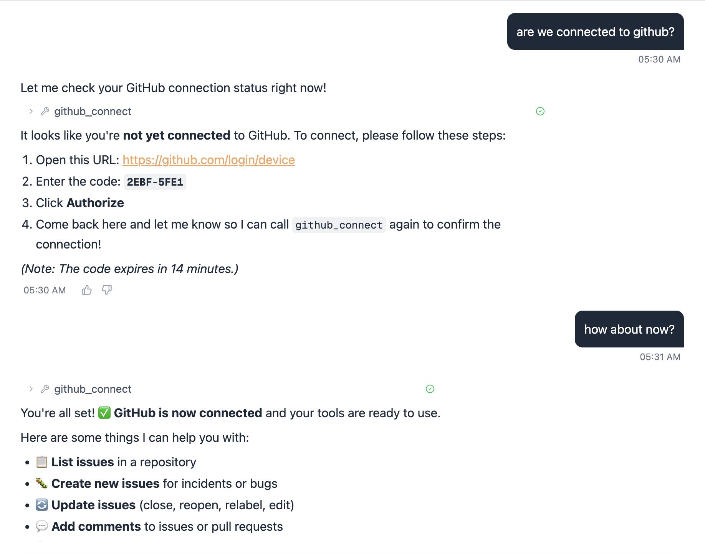
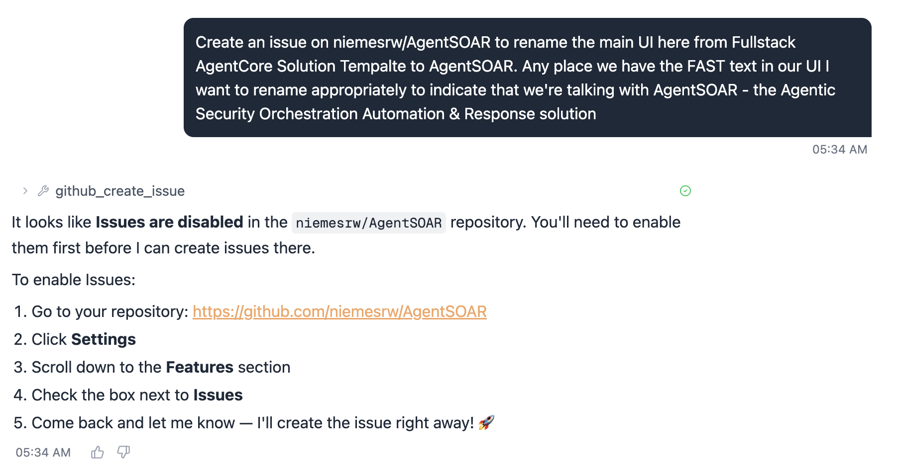
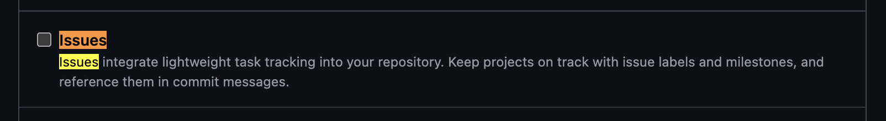
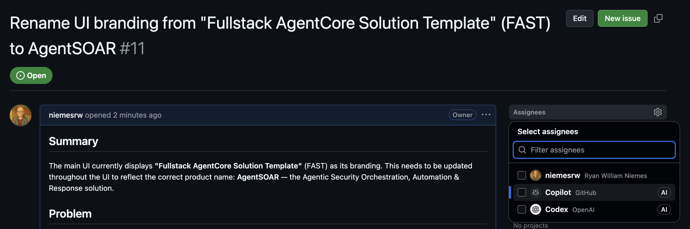
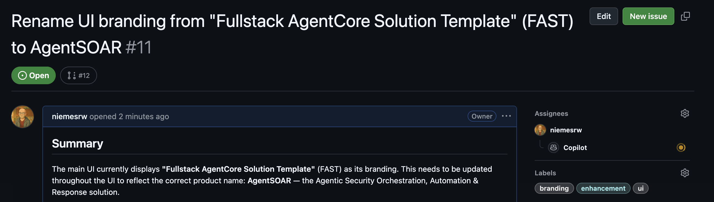
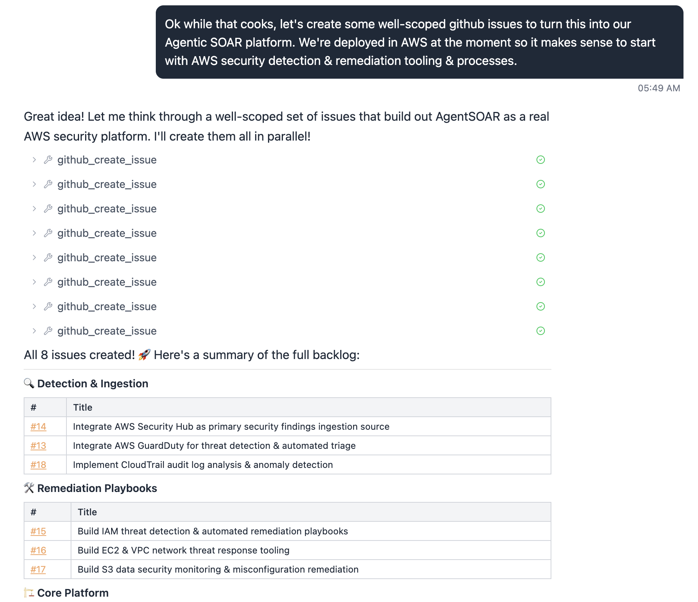
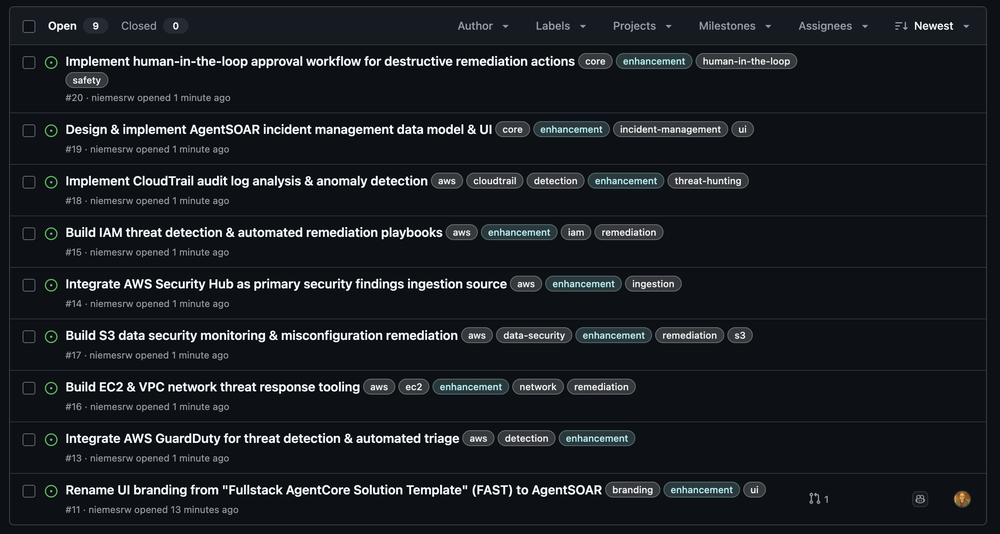
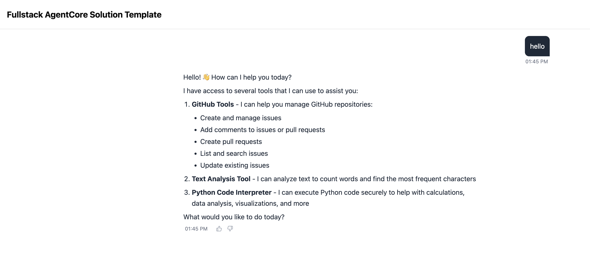
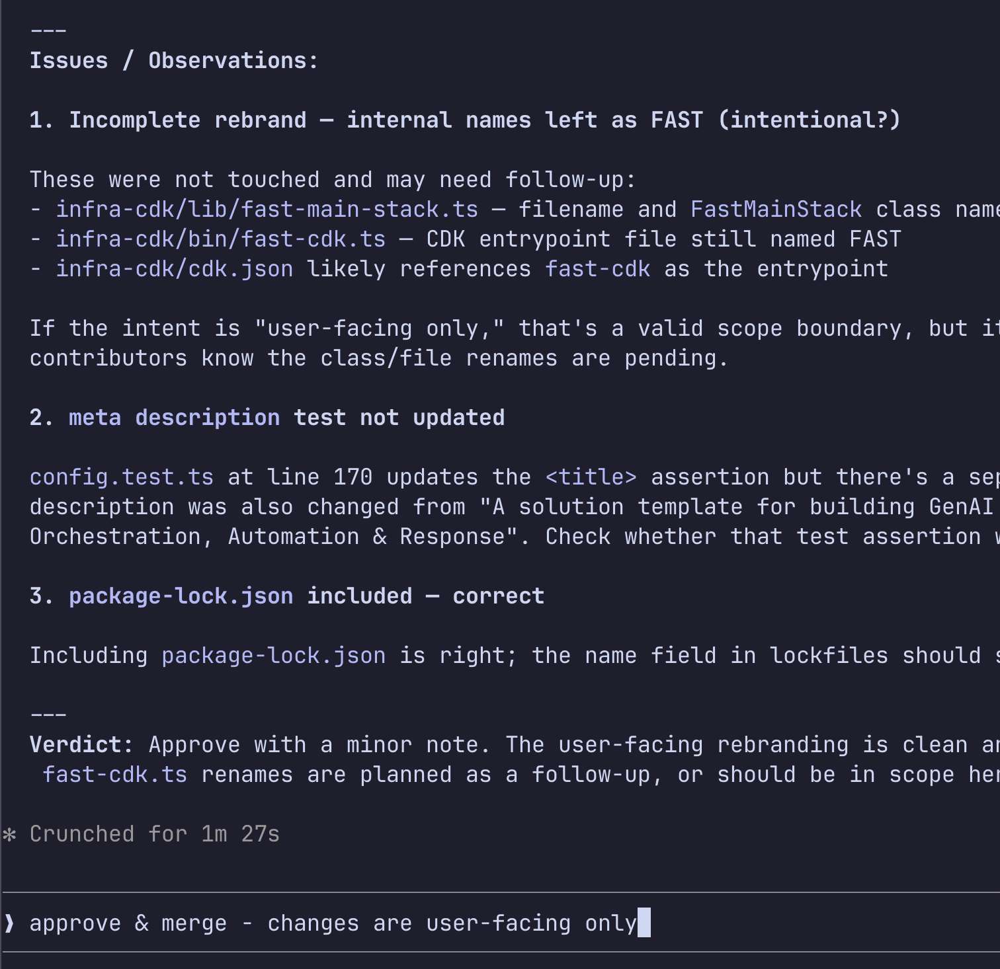

# Building a Modern Agentic SOAR: From Template to Self-Improving Security Platform

> **Status: In progress** — this post documents the journey as we build it.

---

## Why SOAR is Broken

Security Orchestration, Automation, and Response platforms promised to fix alert fatigue. They didn't. The core problem: traditional SOAR runs **rigid playbooks**. An alert arrives, it pattern-matches against a known rule, and a predetermined sequence of steps executes. When the alert doesn't fit a known pattern — which is increasingly common with sophisticated threats — the playbook stalls and a human has to pick it up cold.

The result is the worst of both worlds: analysts spend their time babysitting automation instead of doing real investigation, and novel threats slip through the cracks between playbooks.

What we actually want is an analyst that can reason: *"This alert looks like lateral movement. Let me pull the host's EDR telemetry, correlate with identity logs, check threat intel, and then recommend containment."* And crucially — one that gets better each time it encounters a gap.

---

## The Agentic Alternative

Amazon Bedrock AgentCore is a managed runtime for deploying AI agents at production scale. It handles the undifferentiated heavy lifting — auth, session management, memory, secure tool access — so you can focus on agent behavior.

Paired with the [FAST template](https://github.com/awslabs/fullstack-solution-template-for-agentcore) (Fullstack AgentCore Solution Template), you get a production-ready fullstack starting point: a React frontend with real-time streaming via the [AG-UI protocol](https://docs.ag-ui.com/concepts/overview), a containerized agent backend, and CDK infrastructure — all wired together.

We forked FAST as [AgentSOAR](https://github.com/niemesrw/AgentSOAR) and are building a modern agentic SOAR on top of it. This post documents what we discover along the way.

### What the stack enables

| SOAR capability | How AgentSOAR delivers it |
|---|---|
| Real-time visibility into agent actions | AG-UI streaming — every tool call visible live in the UI |
| Security tool integrations | AgentCore Gateway MCP — each integration is an MCP server |
| Persistent incident context | AgentCore Memory across sessions |
| Log/artifact analysis | Code Interpreter |
| Human-in-the-loop approvals | CopilotKit action primitives |
| Multi-step reasoning over alerts | Strands or LangGraph agent patterns |
| Auth + session isolation per analyst | AgentCore Runtime handles it |

---

## Step 1: GitHub as the Agent's Nervous System

The first integration we're building is GitHub — and it's not just because GitHub has a great MCP server (though it does). It's because GitHub becomes the connective tissue of the entire platform:

- **Incidents → Issues**: every alert the agent investigates becomes a tracked GitHub issue with full context, timeline, and resolution notes
- **Gaps → Issues**: when the agent hits a missing tool or playbook, it files an issue against itself
- **Remediation → PRs**: containment scripts, config changes, and rule updates flow through pull requests with proper review
- **Audit trail in git**: the entire history of what the agent did, why, and what changed lives in version control

This is a meaningful shift from traditional SOAR case management. Instead of a proprietary incident database, you get a transparent, reviewable, forkable record of every decision.

### How it works technically

The short version: we wrote our own OAuth layer. Here's why.

AgentCore has a built-in Identity service for OAuth — `USER_FEDERATION` — that's supposed to handle token acquisition and storage. We spent time trying to make it work for GitHub. The Custom Resource lifecycle (a Lambda that runs during CDK deploy to register the credential provider), the token vault dance, and the workload token exchange were all moving pieces that didn't compose cleanly. We hit errors at each layer and couldn't find enough documentation to debug our way through.

So we cut it. We wrote a thin OAuth2 module we own entirely and moved on.

#### What we built

**`tools/oauth/`** — a generic per-user, per-provider OAuth2 module:

- `providers.py` — GitHub, Slack, and Gmail configured; add a new provider by adding one entry
- `store.py` — per-user token storage in SSM SecureString at `/{stack}/oauth-token/{provider}/{user_id}`
- `device_flow.py` — [RFC 8628](https://datatracker.ietf.org/doc/html/rfc8628) device authorization (GitHub's flow — no callback URL required, works from the agent chat)
- `web_flow.py` — [RFC 7636](https://datatracker.ietf.org/doc/html/rfc7636) Authorization Code + PKCE (Slack, Gmail, anything with a redirect URI)

**`tools/github/strands_tools.py`** — `make_github_tools(user_id)` returns eight Strands `@tool` functions bound to the current user: connect, disconnect, list/create/update issues, add comments, create PRs, search.

**`infra-cdk/lambdas/oauth-callback/`** — a single generic Lambda handles the PKCE code exchange for any web-flow provider. Register its URL once as the redirect URI in your OAuth app.

GitHub credentials (client ID + secret) are stored in Secrets Manager at `/{stack}/oauth-creds/github` via `scripts/configure-oauth.py`. User tokens live in SSM, one parameter per user per provider, isolated and auto-refreshed where the provider supports it (GitHub tokens don't expire, so no refresh needed there).

#### Connecting GitHub from the agent

From the chat UI, the user just types something like *"connect my GitHub account"* and the agent calls `github_connect`:

```
1. Open: https://github.com/login/device
2. Enter code: ABCD-1234
3. Click Authorize
4. Come back here and call github_connect again to confirm
```

That's it. No redirect URLs, no browser pop-ups from the agent. The device flow works headlessly from a chat interface. Call `github_connect` again after authorizing and the token is stored — all subsequent GitHub tool calls use it automatically.



#### First real task: create an issue

With GitHub connected, we asked the agent to file an issue to track renaming the UI from the FAST template name to AgentSOAR. It called `github_create_issue` and immediately hit a wall:



FAST is a template repository and GitHub forks have Issues disabled by default. The agent correctly diagnosed this and gave exact instructions to fix it. One trip to **Settings → Features → Issues**:



After checking the box and re-asking, the issue was created. This is actually a good illustration of how the agent handles tool failures — it doesn't silently swallow the error, it explains the problem and tells you what to do about it.

> **Gotcha**: If you fork from a template repo, Issues are off by default. Enable them in **Settings → Features** before the agent can file anything.

The agent wrote a well-structured issue — summary, problem statement, and the specific strings to update. Issue #11:



#### Human-in-the-loop: assigning the work

The act of assigning the issue is the approval step. The agent filed it; a human reviewed it and decided it was worth doing. We assigned it to an AI coding assistant to implement:



This is the HITL pattern in practice — the agent identifies a gap and creates a traceable work item, but nothing happens until a human explicitly approves it by assigning it. You can assign to yourself, a teammate, or an AI coding assistant (Claude Code, Copilot, etc.) — the point is that a human made a deliberate decision.

#### Building out the backlog

With the first issue filed and approved, we asked the agent to think bigger: create a well-scoped set of issues to turn AgentSOAR into a real AWS security platform, starting with the integrations that make the most sense for an AWS-deployed SOAR.

The agent created all 8 in parallel:



Three categories, eight issues — AWS Security Hub, GuardDuty, CloudTrail for ingestion; IAM, EC2/VPC, and S3 playbooks for remediation; plus core platform work. Each one a concrete, actionable unit of work that a human (or an AI coding assistant) can pick up and implement independently.

This is the backlog the platform will build against.



---

## Step 2: Closing the Self-Improvement Loop

GitHub integration alone makes the agent a capable responder. Log ingestion makes it a learning system.

The idea: capture structured logs from every agent run — what alert came in, what tools were called, what reasoning was applied, where it got stuck. Feed those logs back into a periodic review cycle where the agent (or a separate evaluator) identifies recurring gaps and files GitHub issues describing them.

The loop looks like this:

```
Alert arrives
  → agent investigates using available tools
  → hits a gap (missing tool, incomplete playbook, ambiguous data)
  → logs the gap with context
  → periodic job summarizes gaps → files GitHub issues
  → issues get prioritized, addressed, merged
  → agent is measurably better next iteration
```

This is the narrative no traditional SOAR can tell. The platform improves itself, with humans in the loop for review and approval, and a full audit trail of every improvement.

*[Log ingestion architecture — coming soon]*

---

## Step 0: Actually Deploying the Thing

Before any SOAR logic, you need a running stack. Here's exactly what it took.

### Prerequisites

| Tool | Notes |
|------|-------|
| Node.js 20+ | |
| AWS CDK CLI | `npm install -g aws-cdk` |
| Python 3.11+ | |
| [OrbStack](https://orbstack.dev/) | Lightweight Docker Desktop replacement for Mac. Docker Desktop also works. CDK needs a container runtime to build Lambda layers and the agent image. |
| AWS CLI | Configured with a named profile |
| [AgentCore MCP Server](https://github.com/awslabs/amazon-bedrock-agentcore-mcp-server) | Optional but recommended — gives your AI coding assistant live access to AgentCore docs. See config below. |

**AgentCore MCP Server** (add to your Claude Code / Cursor MCP config):

```json
{
  "mcpServers": {
    "bedrock-agentcore-mcp-server": {
      "command": "uvx",
      "args": ["awslabs.amazon-bedrock-agentcore-mcp-server@latest"],
      "env": { "FASTMCP_LOG_LEVEL": "ERROR" },
      "disabled": false,
      "autoApprove": ["search_agentcore_docs", "fetch_agentcore_doc"]
    }
  }
}
```

This lets Claude Code search and fetch AgentCore documentation inline while you're building — no context-switching to browser tabs.

One non-obvious thing: **macOS native containers won't work here**. AgentCore Runtime requires a Linux ARM64 image. OrbStack runs Linux containers natively on Apple Silicon — no Rosetta, no cross-compilation needed.

### The deploy sequence

```bash
# 1. Clone your fork
gh repo clone niemesrw/AgentSOAR
cd AgentSOAR

# 2. Set your stack name in infra-cdk/config.yaml
#    (leave admin_user_email as null — set it locally, don't commit it)

# 3. Install CDK deps
cd infra-cdk && npm install

# 4. Bootstrap (once per account/region)
cdk bootstrap --profile your-profile

# 5. Deploy the backend
cdk deploy --profile your-profile

# 6. Deploy the frontend
cd ..
AWS_PROFILE=your-profile python3 scripts/deploy-frontend.py
```

Total time: about 6 minutes. CDK creates Cognito, ECR, the AgentCore Runtime, AgentCore Gateway, a DynamoDB feedback table, CloudFront, and Amplify Hosting in one shot. The frontend script pulls the stack outputs, generates `aws-exports.json`, builds the React app, and pushes it to Amplify.

### The one gotcha

OrbStack puts its binaries in `~/.orbstack/bin/` but that path may not be in your shell's PATH when CDK runs (especially in a terminal session that predated OrbStack starting). If you hit `spawnSync docker ENOENT`, prefix the command:

```bash
PATH="$PATH:$HOME/.orbstack/bin" cdk deploy --profile your-profile
```

And add it permanently:
```bash
echo 'export PATH="$PATH:$HOME/.orbstack/bin"' >> ~/.zshrc
```

### First login

Since `admin_user_email` is `null` in the committed config, no Cognito user is auto-created. Create one manually in the [Cognito console](https://console.aws.amazon.com/cognito/) — find your user pool, create a user, mark email as verified. You'll get a temporary password to change on first login.

### Choosing the right model and agent pattern

The default FAST config ships with `strands-single-agent` and `us.anthropic.claude-sonnet-4-5-20250929-v1:0`. Neither was right for us.

**Model**: The `us.*` cross-region inference prefix caused an `AccessDeniedException` on `ConverseStream` immediately after deploy. Checking `aws bedrock list-inference-profiles` showed both `us.anthropic.claude-sonnet-4-6` and `global.anthropic.claude-sonnet-4-6` as ACTIVE. We switched to `global.anthropic.claude-sonnet-4-6` — the latest model, widest availability, no access issues.

**Agent pattern**: FAST ships multiple patterns. The `agui-strands-agent` pattern produces native AG-UI SSE events, which the frontend parses with the AG-UI client for real-time streaming of every tool call and reasoning step. The `strands-single-agent` pattern uses a simpler response format with a different frontend parser. For a SOAR dashboard where analysts watch the agent work in real time, AG-UI is the right choice — you want to see every tool invocation as it happens, not a final answer.

Switching is a one-line change in `infra-cdk/config.yaml`:

```yaml
pattern: agui-strands-agent
```

CDK re-builds and pushes a new container image on the next deploy. The Runtime update took about 8 seconds.

### Wiring up GitHub OAuth

After deploy, store your GitHub OAuth app credentials (client ID + secret) using the configure script:

```bash
python scripts/configure-oauth.py --provider github --profile your-profile
```

The script prompts for your client ID and secret and stores them in Secrets Manager at `/{stack}/oauth-creds/github`. Create a GitHub OAuth App at **Settings → Developer settings → OAuth Apps** if you don't have one — the callback URL from the CDK output `OAuthCallbackUrl` goes in the **Authorization callback URL** field (used for Slack/Gmail web-flow; GitHub device flow doesn't need it but GitHub requires the field to be set).

No redeploy needed after storing credentials. Users connect their own GitHub accounts from the agent chat — see above.

### It works



The baseline FAST chat UI — logged in, agent running on Claude Sonnet 4.6 via the AG-UI pattern. From here, we start turning it into a SOAR.

---

## Step 3: Rebranding with Claude Code + Copilot

With GitHub integrated, we hit a natural next task: the fork still had "Fullstack AgentCore Solution Template" (FAST) branding throughout the UI, CDK stack descriptions, and Cognito email templates. Copilot opened a draft PR to swap all user-facing strings for AgentSOAR branding.

### The review workflow

This is where Claude Code becomes part of the development loop. Rather than reading a diff manually, we asked Claude Code to review the PR:

```
review https://github.com/niemesrw/AgentSOAR/pull/12
```

Claude Code fetched the PR metadata and full diff via `gh pr view` and `gh pr diff`, then produced a structured review:



The review surfaced two things worth checking:
- **Incomplete rebrand**: internal filenames (`fast-main-stack.ts`, `fast-cdk.ts`) and the `FastMainStack` class name weren't touched. The PR description said "user-facing only" — a valid scope boundary, but worth surfacing so future contributors know renames are pending.
- **Test coverage gap**: the `<title>` assertion in `config.test.ts` was updated, but a parallel assertion for `<meta name="description">` might have been missed.

The verdict was approve — the user-facing string replacement was clean. We confirmed the internal naming was intentionally out of scope and merged in one command:

```
approve & merge - changes are user-facing only
```

Claude Code approved the PR with a note, marked it ready (it was still a draft), squash-merged, and deleted the branch. Total interaction: two messages.

### Why this matters for a SOAR

This is the same loop the agent will run for itself. When the agent files a PR to update a detection rule or add a containment script, a human analyst reviews it — ideally with AI-assisted review surfacing any scope gaps or missing test coverage before the merge. The workflow we just used for a branding PR is the same workflow we'll use for agent-generated security changes.

The review quality is proportional to the context Claude Code has. Because it can run `gh` commands, read the full diff, and grep the codebase for remaining references, it catches things a quick visual skim misses.

---

## What We've Built So Far

- [x] Forked FAST as AgentSOAR
- [x] Deployed to AWS (CDK + Amplify)
- [x] GitHub OAuth connected (device flow, per-user tokens)
- [x] AI-assisted PR review workflow (Claude Code + Copilot)
- [ ] First incident scenario end-to-end
- [ ] Log ingestion pipeline
- [ ] Self-improvement loop demo

---

## What Surprised Us

- **OrbStack PATH issue**: CDK spawns Docker as a subprocess and inherits the shell PATH at launch time. If Docker wasn't in PATH when you opened the terminal, CDK can't find it even after OrbStack starts. Prefix with `PATH=...` or restart the terminal.
- **No personal data in config**: Committing `admin_user_email` to a public repo is a bad idea — Copilot caught it in code review. Keep it local.
- **`cdk deploy` does more than you think**: AgentCore Runtime, Gateway, Memory, Cognito, CloudFront, Amplify — all in one command. The FAST template earns its name.
- **AgentCore Identity isn't ready for this use case**: FAST ships with an AgentCore Identity `USER_FEDERATION` setup for OAuth. We spent time trying to make it work for GitHub and hit dead ends at every layer — Custom Resource lifecycle errors, token vault auth, workload token exchange. The docs don't cover the failure modes. We cut it and wrote a thin RFC 8628 / RFC 7636 OAuth module instead. Took less time than debugging the managed version.
- **Default model and pattern aren't production-ready**: The shipped defaults (`strands-single-agent`, `us.anthropic.claude-sonnet-4-5`) caused an immediate `AccessDeniedException`. Check `list-inference-profiles` for what's actually ACTIVE in your account, use the `global.*` prefix for best availability, and pick the agent pattern that matches your frontend parser before first deploy.

---

## What's Next

- Multi-agent triage: specialized sub-agents for enrichment, containment, and reporting working in parallel
- CopilotKit integration for richer human-in-the-loop approval flows
- Alert ingestion webhooks (PagerDuty, Splunk, custom)
- Playbook-as-code: encoding SOC runbooks as structured LangGraph graphs

---

## Resources

- [AgentSOAR on GitHub](https://github.com/niemesrw/AgentSOAR)
- [FAST template](https://github.com/awslabs/fullstack-solution-template-for-agentcore)
- [Amazon Bedrock AgentCore](https://aws.amazon.com/bedrock/agentcore/)
- [AG-UI Protocol](https://docs.ag-ui.com/concepts/overview)
- [GitHub MCP Server](https://github.com/github/github-mcp-server)
- [CopilotKit](https://www.copilotkit.ai/)
