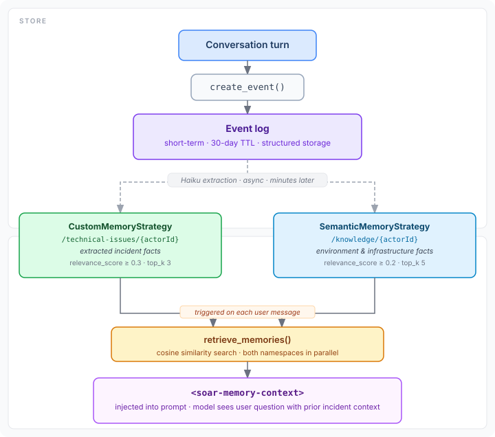

# Part 4 — Multi-Agent Incident Response with A2A

Two things have become clear after running AgentSOAR against real GuardDuty findings:
a single agent with a flat list of tools works for demos but starts showing seams in
production, and the agent forgets everything it learned the moment the session ends.
This post covers both fixes: a memory hooks overhaul that gives the agent persistent
institutional knowledge, and an A2A multi-agent architecture that scales the
orchestration model to match how real incident response actually works.

## The limits of a single agent

The current setup — one Strands agent, all tools in scope, session memory — handles
basic queries well. Ask it about active GuardDuty findings and it does the right thing.
But real incident response is not a single query; it's a pipeline:

```
Alert arrives
  → Is this real or noise? (triage)
  → What happened? (investigation — multiple data sources)
  → What do we do about it? (playbook lookup or generation)
  → Who needs to know? (notification)
  → What changes? (remediation)
```

Each of these steps has different tool access requirements, different reasoning goals,
and different acceptable latencies. Collapsing them into a single agent with a
sprawling system prompt means you're writing one prompt that is simultaneously a triage
specialist, a forensic analyst, a runbook executor, and a communication coordinator.
That prompt becomes impossible to reason about and impossible to test.

The other issue is memory. AgentCore Memory is wired up for session persistence, but
the agent has no mechanism to learn from past incidents. Every new session starts cold.
If the agent triaged a `Recon:IAMUser/MaliciousIPCaller` finding last week and learned
that the actor IP belongs to a known pen test vendor — that context is gone.

## What the AWS A2A sample taught us

AWS released an [A2A multi-agent incident response sample](https://github.com/awslabs/agentcore-samples/tree/main/02-use-cases/A2A-multi-agent-incident-response)
in the [agentcore-samples](https://github.com/awslabs/agentcore-samples) repository
that solves both problems. Three agents — a monitoring agent
(Strands/Claude), a web search agent (OpenAI), and an orchestrating host agent (Google
ADK) — run on separate AgentCore Runtimes and communicate via the
[A2A protocol](https://google.github.io/A2A/), a JSON-RPC 2.0 standard for
agent-to-agent communication.

The memory hooks pattern in the monitoring agent is particularly well-designed. Rather
than a flat "load last N messages", it uses AgentCore Memory's namespace and strategy
system to maintain two distinct knowledge stores and injects them at the right points in
the agent's lifecycle.

Two things from the sample are directly applicable to AgentSOAR. The third — the
specific agent frameworks (Google ADK, OpenAI) — is not, since AgentSOAR is
Strands-native. We're taking the patterns, not the code.

## Part 1 — Memory hooks

### The problem with session-only memory

With session-only memory, the agent's knowledge looks like this:

```
Session 1: "IAMUser/MaliciousIPCaller from 1.2.3.4 — investigated, confirmed pen test"
[session ends]
Session 2: "IAMUser/MaliciousIPCaller from 1.2.3.4 — ?"
```

The second analyst (or the same analyst the next day) starts from scratch. The agent
has no way to say "we've seen this before."

### How it works



The diagram shows the two paths. **Store** (top): every conversation turn is saved via
`create_event()` to the event log. Haiku then runs extraction asynchronously —
minutes later — to distill facts into the long-term vector namespaces.
**Retrieve** (bottom): on each new user message, `retrieve_memories()` does a
cosine similarity search across both namespaces and injects the results as
`<soar-memory-context>` into the prompt before the model ever sees the question.

The storage is fully managed by AWS — the vector index is opaque, similar to a
serverless Pinecone. You interact with it only via the `bedrock-agentcore` API.

### Two memory namespaces

The fix is two namespaces with different extraction strategies in AgentCore Memory:

| Namespace | Strategy | What lives here |
|---|---|---|
| `/technical-issues/{user_id}` | `CustomMemoryStrategy` | Recurring patterns, known-bad IPs, false positive signatures, account-specific quirks |
| `/knowledge/{user_id}` | `SemanticMemoryStrategy` | Factual knowledge about the environment — what services run where, blast radius of specific resources, IAM role usage patterns |

`CustomMemoryStrategy` uses an extraction prompt to decide what to retain — it doesn't
blindly store every message, it distills. `SemanticMemoryStrategy` stores embeddings and
retrieves by similarity, so the agent can retrieve relevant past context even when
the exact terms don't match.

### How the retrieval hooks work

The `bedrock-agentcore` SDK's `AgentCoreMemorySessionManager` already registers a
`MessageAddedEvent` hook internally. Before each user message reaches the model, the
hook calls `retrieve_memories()` against every namespace listed in `retrieval_config`
and injects the results as `<soar-memory-context>` in the prompt. We don't need to
write the hook — we just need to configure which namespaces to search and how.

Two configuration parameters per namespace control retrieval quality:

- **`top_k`** — how many records to return from semantic search
- **`relevance_score`** — minimum cosine similarity to include a record (0.0–1.0)

Technical issues gets a tighter threshold (`0.3`) because incident facts should be
highly specific. The knowledge namespace is broader (`0.2`) since environment facts
are useful even at lower similarity.

### The actual change

This is the complete change to `patterns/agui-strands-agent/agent.py`:

```python
from bedrock_agentcore.memory.integrations.strands.config import (
    AgentCoreMemoryConfig,
    RetrievalConfig,          # added
)

def _create_session_manager(user_id: str, session_id: str) -> AgentCoreMemorySessionManager:
    memory_id = os.environ.get("MEMORY_ID")
    if not memory_id:
        raise ValueError("MEMORY_ID environment variable is required")
    config = AgentCoreMemoryConfig(
        memory_id=memory_id,
        session_id=session_id,
        actor_id=user_id,
        # Search long-term namespaces before each user message.         (added)
        # The session manager's MessageAddedEvent hook retrieves         (added)
        # relevant records and injects them as <soar-memory-context>.   (added)
        retrieval_config={                                               # added
            "/technical-issues/{actorId}": RetrievalConfig(             # added
                top_k=3, relevance_score=0.3                            # added
            ),                                                           # added
            "/knowledge/{actorId}": RetrievalConfig(                    # added
                top_k=5, relevance_score=0.2                            # added
            ),                                                           # added
        },                                                               # added
        context_tag="soar-memory-context",                              # added
    )
    return AgentCoreMemorySessionManager(
        agentcore_memory_config=config,
        region_name=os.environ.get("AWS_DEFAULT_REGION", "us-east-1"),
    )
```

The session manager handles persistence automatically: every exchange is saved to
short-term memory via `create_event()` after invocation, and the memory strategies
run extraction in the background to promote relevant facts into the long-term namespaces.

## Part 2 — A2A multi-agent architecture

### The target architecture

The single agent becomes an orchestrating host agent. Specialized sub-agents handle
the distinct phases of incident response:

```
Incident (GuardDuty finding, CloudTrail anomaly, manual query)
        │
        ▼
Orchestrator Agent  ─── agui-strands-agent (existing, gains A2A delegation)
        │
        ├──► Investigation Agent   ─── GuardDuty + CloudTrail deep analysis
        │                              (separate AgentCore Runtime)
        │
        ├──► Playbook Agent        ─── runbook lookup, containment steps
        │                              (separate AgentCore Runtime)
        │
        └──► Notification Agent    ─── Slack + GitHub issue creation
                                       (separate AgentCore Runtime)
```

Each sub-agent runs as an A2A server (Starlette + `a2a-sdk`). The orchestrator
discovers them via their Agent Cards (`/.well-known/agent-card.json`) and delegates
via `RemoteA2aAgent` instances wired as Strands sub-agents.

### Why not just add more tools to the single agent?

Tools don't isolate failure. If the investigation step takes 30 seconds pulling
CloudTrail events, the notification step waits. With sub-agents, the orchestrator can
run investigation and playbook lookup concurrently — standard A2A parallel delegation.

Tools also don't isolate permissions. The investigation agent needs read access to
GuardDuty and CloudTrail across accounts. The notification agent needs write access
to Slack and GitHub. The playbook agent eventually needs execute access to SSM Run
Command and EC2 actions. Scoping these as separate IAM execution roles on separate
runtimes is significantly cleaner than one agent execution role that holds all of it.

Finally, sub-agents are independently testable and independently deployable. The
investigation agent can be updated with a new tool without redeploying the
orchestrator.

### A2A agent card and server

Each sub-agent implements a standard A2A server. The investigation agent looks like:

```python
# patterns/investigation-agent/main.py

from a2a.server.apps import A2AStarletteApplication
from a2a.server.request_handlers import DefaultRequestHandler
from a2a.types import AgentCard, AgentSkill, AgentCapabilities

agent_card = AgentCard(
    name="Investigation Agent",
    description="Correlates GuardDuty findings with CloudTrail audit logs for deep incident analysis",
    url=f"https://bedrock-agentcore.{region}.amazonaws.com/runtimes/{runtime_arn}/invocations",
    version="1.0.0",
    capabilities=AgentCapabilities(streaming=True),
    skills=[
        AgentSkill(id="correlate_finding", name="Correlate finding with CloudTrail"),
        AgentSkill(id="timeline", name="Build event timeline for a resource"),
        AgentSkill(id="blast_radius", name="Assess blast radius of a compromise"),
    ],
)

app = A2AStarletteApplication(
    agent_card=agent_card,
    http_handler=DefaultRequestHandler(
        agent_executor=InvestigationAgentExecutor(),
        task_store=InMemoryTaskStore(),
    ),
)
```

The `AgentExecutor` wraps the Strands agent and streams responses back via the A2A
`TaskUpdater`:

```python
class InvestigationAgentExecutor(AgentExecutor):
    async def execute(self, context: RequestContext, event_queue: EventQueue):
        updater = TaskUpdater(event_queue, context.task_id, context.context_id)
        async for event in self.agent.stream(context.get_user_input()):
            if event.get("data"):
                await updater.add_artifact([TextPart(text=event["data"])])
        await updater.complete()
```

### How the orchestrator delegates

The existing `agui-strands-agent` gains a `RemoteA2aAgent` for each sub-agent. A
`LazyClientFactory` generates fresh httpx clients with M2M bearer tokens on each
invocation — tokens are obtained via `requires_access_token()` against the Cognito
machine client that already exists in the CDK stack:

```python
# patterns/agui-strands-agent/agent.py  (additions)

from bedrock_agentcore.identity.auth import requires_access_token
from a2a.client import A2AClient, ClientFactory
from strands import Agent
from strands.multiagent import RemoteA2aAgent

class LazyClientFactory(ClientFactory):
    @requires_access_token(provider_name=INVESTIGATION_AGENT_PROVIDER, auth_flow="M2M")
    def get_client(self, url: str, token: str | None = None) -> A2AClient:
        return A2AClient(
            httpx_client=httpx.AsyncClient(
                headers={
                    "Authorization": f"Bearer {token}",
                    "X-Amzn-Bedrock-AgentCore-Runtime-Session-Id": current_session_id(),
                }
            )
        )

investigation_agent = RemoteA2aAgent(
    name="investigation_agent",
    description="Deep incident investigation — correlates GuardDuty findings with CloudTrail and assesses blast radius",
    agent_card_url=get_ssm_param(f"/{STACK_NAME}/investigation-agent-card-url"),
    a2a_client_factory=LazyClientFactory(),
)

root_agent = Agent(
    model="us.anthropic.claude-sonnet-4-6-20251101-v1:0",
    system_prompt=ORCHESTRATOR_PROMPT,
    tools=[...existing_tools...],
    sub_agents=[investigation_agent, playbook_agent, notification_agent],
)
```

The orchestrator's system prompt instructs it to delegate full investigation tasks to
`investigation_agent` rather than calling GuardDuty and CloudTrail tools directly. The
direct tools remain available for quick lookups — "do we have any active findings?" goes
through the tool directly; "investigate this finding and tell me the blast radius" gets
delegated.

### CDK changes

Each sub-agent runtime is a new CDK nested stack following the same pattern as the
existing `BackendStack`:

```typescript
// infra-cdk/lib/investigation-agent-stack.ts

new CfnAgentRuntime(this, "InvestigationAgentRuntime", {
  agentRuntimeName: `${stackName}-investigation-agent`,
  agentRuntimeArtifact: {
    containerConfiguration: {
      containerUri: investigationAgentImage.imageUri,
    },
  },
  roleArn: investigationAgentRole.roleArn,
  networkConfiguration: { networkMode: "PUBLIC" },
  protocolConfiguration: { serverProtocol: "HTTP" },
});

// Agent card URL stored in SSM so orchestrator can discover it
new ssm.StringParameter(this, "InvestigationAgentCardUrl", {
  parameterName: `/${stackName}/investigation-agent-card-url`,
  stringValue: `https://bedrock-agentcore.${region}.amazonaws.com/runtimes/${runtime.attrAgentRuntimeArn}/invocations`,
});
```

The M2M auth requires a new Cognito scope for each sub-agent runtime. The machine
client in `CognitoStack` gains one scope per sub-agent:

```typescript
// infra-cdk/lib/cognito-stack.ts (additions)

const resourceServer = new cognito.UserPoolResourceServer(
  this, "AgentResourceServer", {
    userPool,
    identifier: "agentsoar-agents",
    scopes: [
      { scopeName: "investigation", scopeDescription: "Invoke investigation agent" },
      { scopeName: "playbook",      scopeDescription: "Invoke playbook agent" },
      { scopeName: "notification",  scopeDescription: "Invoke notification agent" },
    ],
  }
);
```

### Inter-agent context passing

Each A2A message from the orchestrator includes the original incident context (finding
ID, severity, affected resource) in the message body. The sub-agent's memory hooks pick
up the `actor_id` from the request headers (`X-Amzn-Bedrock-AgentCore-Runtime-Custom-Actorid`)
and use it to retrieve investigation notes from past incidents involving the same
resource or finding type.

This is the memory hooks paying off at the multi-agent level: the investigation agent
not only searches its own conversation history, it searches across all past incidents
for the same actor. The orchestrator doesn't need to pass historical context explicitly
— the sub-agent retrieves it.

## Design decisions

**Keep the existing `agui-strands-agent` as the orchestrator.** It already owns the
AG-UI streaming connection and the Cognito user session. Making it the entry point
means no changes to the frontend or to how sessions are established.

**Sub-agents are Strands, not mixed frameworks.** The A2A sample uses Google ADK,
Strands, and OpenAI — heterogeneous by design to demonstrate protocol interop. For
AgentSOAR, Strands uniformity is more valuable than framework variety. All sub-agents
use the same SDK, same tool pattern, same deployment model.

**GuardDuty and CloudTrail tools move to the investigation agent.** They currently live
on the main agent via the Gateway. Moving them reduces the orchestrator's tool surface
and scopes the cross-account IAM role to the investigation agent's execution role only.

**Tools stay in the Gateway.** The Gateway MCP pattern doesn't change. Sub-agents
initialize their own `MCPClient` pointing at the same Gateway endpoint, scoped to the
tools they need. The Gateway stays the single control plane for tool access and auditing.

**A2A is additive.** The orchestrator with no active sub-agents behaves identically to
the current single-agent setup. Sub-agents can be rolled out incrementally — deploy the
investigation agent first, add it to the orchestrator's sub-agent list, verify, then
add playbook and notification agents.

## What's next

- **Investigation agent first** — implement `patterns/investigation-agent/` with the
  GuardDuty and CloudTrail tools, A2A server, and memory hooks. Wire it into the
  orchestrator as the first RemoteA2aAgent.
- **Playbook agent** — load account-specific runbooks from SSM and generate
  step-by-step containment instructions tailored to the affected resource type.
- **Notification agent** — the GitHub and Slack tools (already OAuth-connected) move
  here. The orchestrator delegates "file a GitHub issue for this incident" rather than
  calling GitHub tools directly.
- **Parallel delegation** — once all three sub-agents exist, update the orchestrator
  prompt to run investigation and playbook lookup concurrently via A2A parallel
  streaming.
